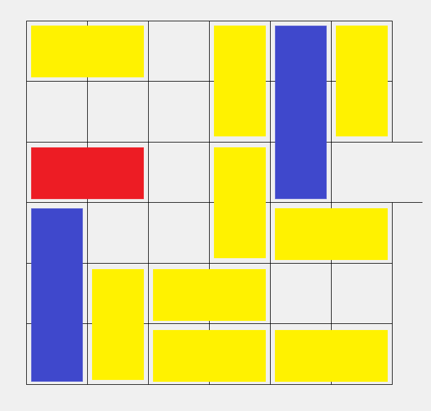

# Pond-Solver

## Solver for the game "Pond": a Klotski-alike game

## Example:

## The goal is to move the red block to the gap on the right while each block can only move in the same direction as its orientation
 

## Usage: Simply run Pond_Solver.py and follow the descriptions inside